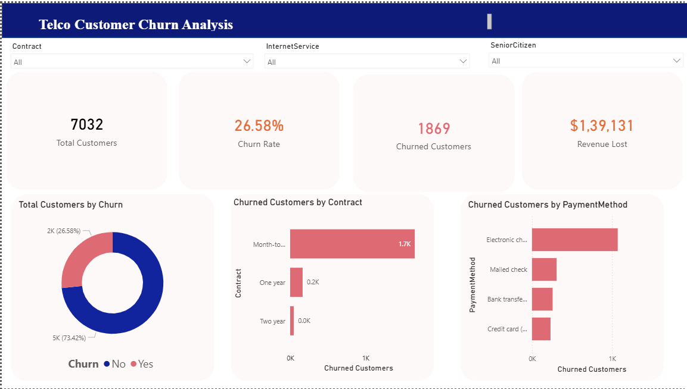
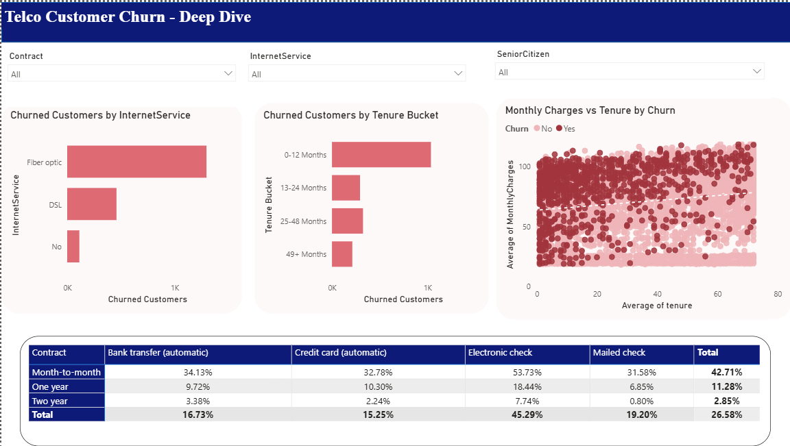

# Telco Customer Churn Analysis

# Overview 
The main aim of this project is to build a predictive model that identifies the most likely customers to churn and suggests retention strategies, using tools such as Python,SQL,Power BI and Machine Learning. 

# Dashboard 

# 📂 Dataset
[IBM Telco Customer Churn — Kaggle](https://www.kaggle.com/datasets/blastchar/telco-customer-churn)

# 👩‍💻 Author
Nichelle Wilson Godad
